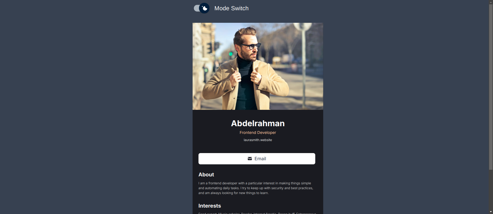
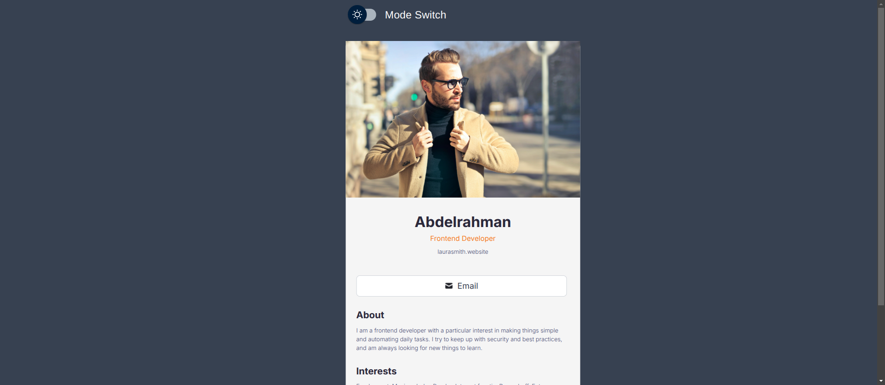
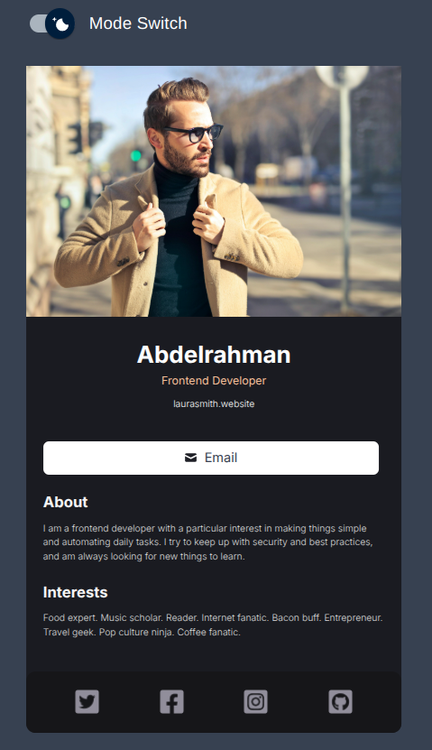
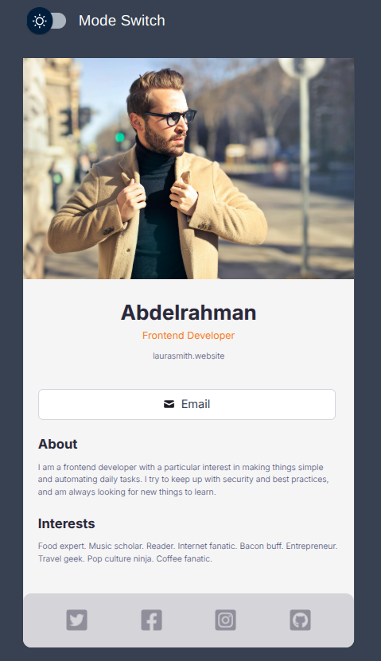

# 💼 Digital Business Card

## Table of Contents

- [Table of Contents](#table-of-contents)

- [👋Introduction](#introduction)

- [🌟Features](#features)

- [🚀 Live Project](#-live-project)

- [📸 Screenshots](#-screenshots)

- [💡Technique Skills](#Technique-skills)

- [🛠️Technologies Used](#️technologies-used)

- [🏁Getting Started](#getting-started)

- [⬇️Installation](#️installation)

- [🔧Usage](#usage)

- [📄License](#license)

## 👋Introduction
The Digital Business Card project is a web application built using React and Material-UI. It allows users to create and display a digital business card with a light/dark theme toggle feature. The application is designed to be modular and easy to maintain, with reusable components and custom-styled elements.

## 🌟Features
- Light/Dark Theme Toggle: Users can switch between light and dark themes using a toggle switch.
Custom Styling: The application uses - - - custom-styled components to provide a unique look and feel.
- Component-Based Architecture: The application is structured using React components, making it modular and easy to maintain.
- Image Display: The application displays an image as part of the business card.

## 🚀 Live project

[💼 Digital Business Card](https://digital-business-card-delta-lemon.vercel.app/)

## 📸 Screenshots









## 💡Technique Skills
- **Theme Switching**
 allows users to switch between light and dark themes using a toggle switch. This is implemented using the useState and useEffect hooks to manage and apply the theme to the document body.

```
const [theme, setTheme] = useState("Light");

useEffect(() => {
  document.body.className = theme;
}, [theme, setTheme]);
```
- **Styled Components**

The project uses Material-UI's styled function to create custom-styled components, such as the MaterialUISwitch. This switch component is customized with specific styles for both light and dark themes.
```
<FormControlLabel
  control={<MaterialUISwitch sx={{ m: 1 }} />}
  label="Mode Switch"
  sx={{ color: '#FFF' }}
  onClick={() => setTheme(theme === "Light" ? "Dark" : "Light")}
/>
```

- **Reusable Button**
  created reusable Button component like Btn.

```
import message from "../images/Icon.png";

export default function Btns() {
  return (
    <>
      <a className="big-btn"  href="#">
        
        Email
      </a>

    </>
  );
}


```

- **Reusable Components**
  created reusable components like Post.

```
import x from "../images/Twitter Icon.png"
import facebook from "../images/Facebook Icon.png"
import insetgram from "../images/Instagram Icon.png"
import github from "../images/GitHub Icon.png"
export default function Footer() {
  return (
    <div className=" contact">
      
      
      
      
    </div>
  );
```

## 🛠️Technologies Used

The Digital Business Card project utilizes the following technologies:

-  &nbsp; &nbsp;[Html](https://html.com/)

-  &nbsp; &nbsp;[Css](https://www.w3.org/Style/CSS/Overview.en.html)

-  &nbsp; &nbsp;[React](https://reactjs.org/)

-  &nbsp; &nbsp;[Matrial Ui](https://mui.com/material-ui/api/svg-icon/)

## 🏁Getting Started

To set up the Digital Business Card project locally, follow the instructions below.

## ⬇️Installation

To set up the project locally, follow these steps:

1. Clone the repository:

```bash

git clone https://github.com/Abdelrahman-wahed/digital-business-card.git

```

2. Navigate to the project directory:

```bash

cd digital-business-card

```

3. Install the required dependencies:

```bash

npm install

```

## 🔧Usage

1. Run the development server:

```bash

npm run dev

```

2. Open your browser and go to `http://localhost:5173/` to view the application.

## License

This project is licensed under the MIT License - see the [LICENSE](LICENSE.md) file for details.
